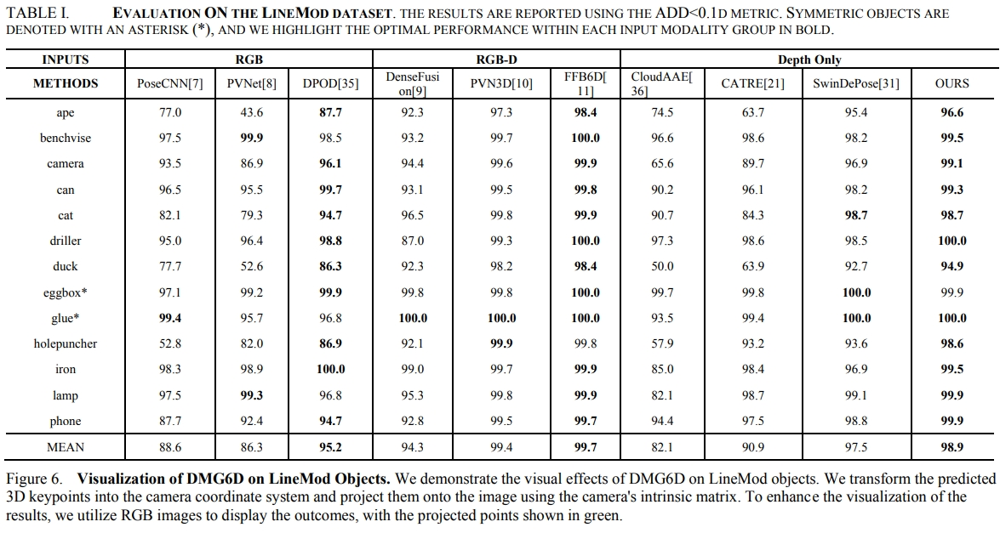

# [IEEE CASE 2024]DMG6D: A Depth-based Multi-Flow Global Fusion Network for 6D Pose Estimation

This is a official implementation for paper "DMG6D: A Depth-based Multi-Flow Global Fusion Network for 6D Pose Estimation"

## Table of Contents  

- [DMG6D](#dmg6d)
  - [Table of Content](#table-of-content)
  - [Introduction & Citation](#introduction--citation)
  - [Installation](#installation)
  - [Code Structure](#code-structure)
  - [Datasets](#datasets)
  - [Training and evaluating](#training-and-evaluating)
    - [Training on the LineMOD Dataset](#training-on-the-linemod-dataset)
    - [Evaluating on the LineMOD Dataset](#evaluating-on-the-linemod-dataset)
    - [Visualizaion on the LineMOD Dataset](#visualizaion-on-the-linemod-dataset)
    - [Training on the Occ-LineMod Dataset](#training-on-the-occ-linemod-dataset)
    - [Evaluating on the Occ-LineMod Dataset](#evaluating-on-the-occ-linemod-dataset)
    - [Visualization on the Occ-LineMod Dataset](#visualizaion-on-the-occ-linemod-dataset)
  - [Results](#results)
  - [License](#license)


## Introduction & Citation
<div align=center></div>

DMG6D is a general framework for representation learning from a depth image, and we applied it to the 6D pose estimation task by cascading downstream prediction headers for instance semantic segmentation and 3D keypoint voting prediction from FFB6D.

## Installation - From conda
 - Install conda environment from conda environment.yml (it might take a while, and don't forget changing the prefix in the end of environment.yml file)
```bash 
conda env create -f dmg6d/environment.yml
```
- Activate our swin-pose conda environment
```bash
conda activate lab-swin
```
- Install mmseg within conda
```bash 
pip install -r dmg6d/mmseg_install.txt
```
- Following [normalSpeed](https://github.com/hfutcgncas/normalSpeed) to install normalSpeed within conda
```bash
pip3 install "pybind11[global]"
git clone https://github.com/hfutcgncas/normalSpeed.git
cd normalSpeed
python3 setup.py install --user
```
- Install some neccessary package
```bash 
cd models/RandLA
sh compile_op.sh
```
Due to lacking of apex installation, you may have to delete all apex related modules and functions.
- To infer pose for ROS manipulation system,
```bash
sh scripts/test_single_lab.sh
```
## Installation - From docker 
- Pull docker image from docker hub
```bash 
docker pull zhujunli/swin-pose:latest
```
- Run our swin-pose docker
```bash 
sudo nvidia-docker run --gpus all --ipc=host --shm-size 50G --ulimit memlock=-1 --name your_docker_environment_name -it --rm -v your_workspace_directory:/workspace zhujunli/swin-pose:latest
```
- Install mmseg within docker
```bash 
pip install -r dmg6d/mmseg_install.txt
```
- Install some neccessary package
```bash 
cd models/RandLA
sh compile_op.sh
```
## Code Structure

<details>
  <summary>[Click to expand]</summary>

- **dmg6d**
  - **dmg6d/apps**
    - **dmg6d/apps/train_lm.py**: Training & Evaluating code of DMG6D models for the LineMOD dataset.
    - **dmg6d/apps/train_occlm.py**: Training & Evaluating code of DMG6D models for the Occ-LineMOD dataset.
  - **dmg6d/config**
    - **dmg6d/config/common.py**: Some network and datasets settings for experiments.
    - **dmg6d/config/options.py**: Training and evaluating parameters settings for experiments.
  - **dmg6d/scripts**
    - **dmg6d/scripts/train_lm.sh**: Bash scripts to start the traing on the LineMOD dataset.
    - **dmg6d/scripts/test_lm.sh**: Bash scripts to start the testing on the LineMOD dataset.
    - **dmg6d/scripts/train_occlm.sh**: Bash scripts to start the training on the Occ-LineMOD dataset.
    - **dmg6d/scripts/test_occlm.sh**: Bash scripts to start the testing on the Occ-LineMOD dataset.
  - **dmg6d/datasets**
    - **dmg6d/datasets/linemod/**
      - **dmg6d/datasets/linemod/linemod_dataset.py**: Data loader for LineMOD dataset.
      - **dmg6d/datasets/linemod/create_angle_npy.py**: Generate normal vector angles images for real scene Linemod datset.
    - **dmg6d/datasets/occ_linemod**
      - **dmg6d/datasets/occ_linemod/occ_dataset.py**： Data loader for Occ-LineMOD dataset.
      - **dmg6d/datasets/occ_linemod/create_angle_npy.py**：Generate normal vector angles images for Occ-Linemod datset.
  - **dmg6d/mmsegmentation**: packages of swin-transformer.
  - **dmg6d/models**
    - **dmg6d/models/DMG6D.py**: Network architecture of the proposed DMG6D.
    - **dmg6d/models/cnn**
      - **dmg6d/models/cnn/extractors.py**: Resnet backbones.
      - **dmg6d/models/cnn/pspnet.py**: PSPNet decoder.
      - **dmg6d/models/cnn/ResNet_pretrained_mdl**: Resnet pretraiend model weights.
    - **dmg6d/models/loss.py**: loss calculation for training of FFB6D model.
    - **dmg6d/models/pytorch_utils.py**: pytorch basic network modules.
    - **dmg6d/models/RandLA/**: pytorch version of RandLA-Net from [RandLA-Net-pytorch](https://github.com/qiqihaer/RandLA-Net-pytorch)
  - **dmg6d/utils**
    - **dmg6d/utils/basic_utils.py**: basic functions for data processing, visualization and so on.
    - **dmg6d/utils/meanshift_pytorch.py**: pytorch version of meanshift algorithm for 3D center point and keypoints voting.
    - **dmg6d/utils/pvn3d_eval_utils_kpls.py**: Object pose esitimation from predicted center/keypoints offset and evaluation metrics.
    - **dmg6d/utils/ip_basic**: Image Processing for Basic Depth Completion from [ip_basic](https://github.com/kujason/ip_basic).
    - **dmg6d/utils/dataset_tools**
      - **dmg6d/utils/dataset_tools/DSTOOL_README.md**: README for dataset tools.
      - **dmg6d/utils/dataset_tools/requirement.txt**: Python3 requirement for dataset tools.
      - **dmg6d/utils/dataset_tools/gen_obj_info.py**: Generate object info, including SIFT-FPS 3d keypoints, radius etc.
      - **dmg6d/utils/dataset_tools/rgbd_rnder_sift_kp3ds.py**: Render rgbd images from mesh and extract textured 3d keypoints (SIFT/ORB).
      - **dmg6d/utils/dataset_tools/utils.py**: Basic utils for mesh, pose, image and system processing.
      - **dmg6d/utils/dataset_tools/fps**: Furthest point sampling algorithm.
      - **dmg6d/utils/dataset_tools/example_mesh**: Example mesh models.
  - **dmg6d/train_log**
    - **dmg6d/train_log/**
      - **dmg6d/train_log/{your experiment name}/checkpoints/**: Storing trained checkpoints on your experiment.
      - **dmg6d/train_log/{your experiment name}/eval_results/**: Storing evaluated results on your experiment.
      - **dmg6d/train_log/{your experiment name}/train_info/**: Training log on your experiment.
- **figs/**: Images shown in README.

</details>

## Datasets
- ### Download real and prepare synthetic LineMod Dataset 
  - Download the preprocessed LineMOD dataset from [onedrive link](https://hkustconnect-my.sharepoint.com/:u:/g/personal/yhebk_connect_ust_hk/ETW6iYHDbo1OsIbNJbyNBkABF7uJsuerB6c0pAiiIv6AHw?e=eXM1UE) or [google drive link](https://drive.google.com/drive/folders/19ivHpaKm9dOrr12fzC8IDFczWRPFxho7) (refer from [DenseFusion](https://github.com/j96w/DenseFusion)). Unzip it and link the unzipped ``Linemod_preprocessed/`` to ``ffb6d/datasets/linemod/Linemod_preprocessed``:
  ```shell
  ln -s path_to_unzipped_Linemod_preprocessed ffb6d/dataset/linemod/
  ```
- ### Generate LindMod Normal Vector Angles Images 
  - For **synthetic** dataset:
  0. Generate rendered and fused data following [raster_triangle](https://github.com/ethnhe/raster_triangle).
  1. Open raster_triangle folder. Replace its fuse.py to dmg6d/fuse.py and rgbd_renderer.py to dmg6d/rgbd_renderer.py. 
  2. Link the Linemod to the current folder. 
        ``` ln -s path_to_Linemod_preprocessed ./Linemod_preprocessed ```
      Don't have to do it every time. 
  3. Render renders_nrm/ data. For example, for phone class.
      ``` python3 rgbd_renderer.py --cls phone --render_num 10000 ```
  4. Render fuse_nrm/ data. For example, for phone class.
      ``` python3 fuse.py --cls phone --fuse_num 10000 ```
  - For **real** dataset: Open dmg6d/datasets/linemod/
    ```bash 
    python -m create_angle_npy.py --cls_num your_cls_num --train_list 'train.txt' --test_list 'test.txt'
    ```
- ### Download Occ-LindMod Dataset
  - Download the BOP Occ-LineMOD dataset from (https://bop.felk.cvut.cz/datasets/)
- ### Generate Occ-LindMod Normal Vector Angles Images 
  - For both **pbr_synthetic** and **real** dataset: Open dmg6d/datasets/occ_linemod/
    ```bash 
    python -m create_angle_npy.py --cls_num your_cls_num --train_list 'train.txt' --test_list 'test.txt'
    ```

## Training and evaluating

### Training on the LineMOD Dataset

- Train the model for the target object.
      ``` bash sh scripts/train_lm.sh ```
    The trained checkpoints are stored in ``experiment_name/train_log/linemod/checkpoints/{cls}/``.

### Evaluating on the LineMOD Dataset

- Start evaluation by:
      ``` bash sh scripts/test_lm.sh ```
  You can evaluate different checkpoint by revising ``tst_mdl`` to the path of your target model.
- **Pretrained model**: We provide our pre-trained models for each object on onedrive, [link](https://cuny547-my.sharepoint.com/:u:/g/personal/zli3_gradcenter_cuny_edu/EUWe0Qe2i6BJvEiOn_iVQjUBeRHzW-JZ_1zt4bVIzAJFnA?e=BwthPd). Download them and move them to their according folders. For example, move the ``ape_best.pth.tar`` to ``train_log/linemod/checkpoints/ape/``. Then revise ``tst_mdl=train_log/linemod/checkpoints/ape/ape_best.path.tar`` for testing.

### Visualizaion on the LineMOD Dataset

- After training your models or downloading the pre-trained models, you can visualizing the results:
      ``` bash sh scripts/test_lm_vis.sh ```

### Training on the Occ-LineMOD Dataset

- Train the model for the target object. 
  
  ``` bash sh scripts/train_occlm.sh ```
  
    The trained checkpoints are stored in 
    ``experiment_name/train_log/occ_linemod/checkpoints/{cls}/``.

### Evaluating on the Occ-LineMOD Dataset

- Start evaluation by:
      ``` bash sh scripts/test_occlm.sh ```

  You can evaluate different checkpoint by revising ``tst_mdl`` to the path of your target model.
- **Pretrained model**: We provide our pre-trained models for each object on onedrive, [link](https://cuny547-my.sharepoint.com/:u:/g/personal/zli3_gradcenter_cuny_edu/EWfHIHFg6MtKntTzBkOdzM4BPP41nlXWfVI-IAdj_K1-4g?e=gajiZ1). Download them and move them to their according folders. 

### Visualizaion on the Occ-LineMOD Dataset

- After training your models or downloading the pre-trained models, you can visualizing the results:
      ``` bash sh scripts/test_occlm_vis.sh ```

### Training on the YCBV Dataset

- Train the model for the target object. 
  
  ``` bash sh scripts/train_ycb.sh ```
  
    The trained checkpoints are stored in 
    ``experiment_name/train_log/ycb/checkpoints/ycb.pth.tar``.

### Evaluating on the YCBV Dataset

- Start evaluation by:
      ``` bash sh scripts/test_ycb.sh ```

  You can evaluate different checkpoint by revising ``tst_mdl`` to the path of your target model.
- **Pretrained model**: We provide our pre-trained models on onedrive, [link](https://cuny547-my.sharepoint.com/:u:/g/personal/zli3_gradcenter_cuny_edu/Eb29fBpSZz1IrydJphLG_q0ByKantwDF_NTc095w79J1Cw?e=aWKL3P). Download them and move them to their according folders. 
## Results
<details>
  <summary>[Click to expand]</summary>

- **Evaluation on the LineMod Dataset**
<div align=center></div>

- **Qualitative Results on the LineMod Dataset**
<div align=center></div>


## License
DMG6D is released under the MIT License (refer to the LICENSE file for details).
